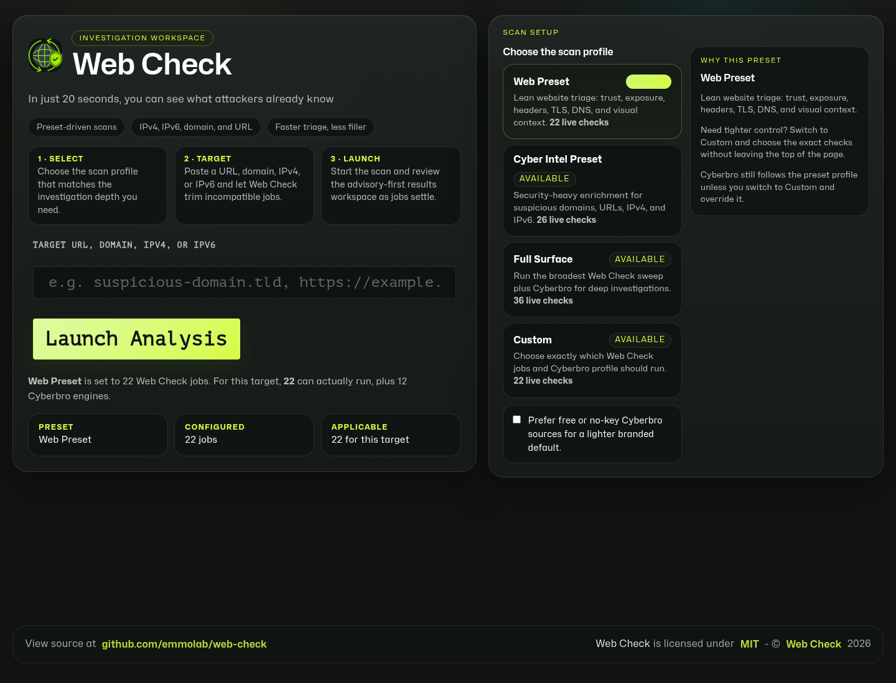
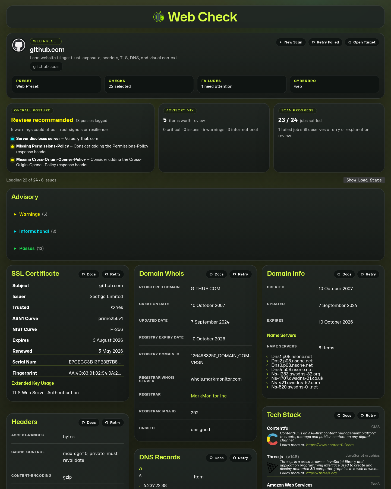
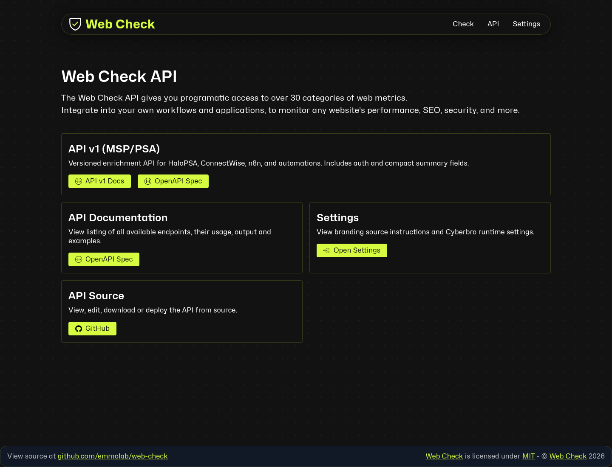

# Web Check

Self-hosted website intelligence for MSPs, MSSPs, and operators who need a fast view of what a domain exposes. Web Check accepts a URL, domain, IPv4, or IPv6 target, runs web, DNS, TLS, infrastructure, and threat-intelligence checks, then presents the findings in a single investigation workspace.

This fork focuses on self-hosted deployments, environment-driven branding, Cyberbro threat-intel enrichment, and a versioned API for PSA / automation workflows.

## Screenshots

### Investigation workspace



### Example scan results



### API and PSA integrations



## Highlights

- Preset-driven scans for websites, domains, IPv4, and IPv6 targets
- DNS, WHOIS, HTTP headers, cookies, redirects, robots.txt, security.txt, TLS, and server-status checks
- Infrastructure discovery including IP, ports, geolocation, hostnames, and server metadata
- Cyberbro-backed threat-intelligence cards for deeper suspicious-domain workflows
- Environment-driven whitelabel branding for self-hosted MSP/MSSP deployments
- Versioned `/api/v1` enrichment API for HaloPSA, ConnectWise, n8n, and internal automations
- GHCR-first Docker deployment flow

## Quick start

### Docker Compose

```bash
git clone https://github.com/emmolab/web-check.git
cd web-check
cp .env.sample .env
docker compose pull
docker compose up -d
```

Default services:

- Web Check: `http://localhost:3000`
- Cyberbro: `http://localhost:5000`

### Local development

Requirements:

- Node.js `>= 22`
- Yarn `1.x` via Corepack

```bash
corepack enable
yarn install
yarn dev
```

Useful checks:

```bash
yarn lint
yarn typecheck
yarn build
```

## API v1 for MSP / PSA workflows

API v1 provides a stable JSON surface for automations that need compact, predictable enrichment fields.

Key endpoints:

- `GET /api/v1/health`
- `GET /api/v1/capabilities`
- `GET /api/v1/lookup?target=<domain-or-url>`

Set `WEB_CHECK_API_KEY` to require `X-API-Key` or `Authorization: Bearer` authentication on v1 routes. Leave it unset for private local development.

Example:

```bash
curl -H 'X-API-Key: your-key' \
  'https://your-web-check.example/api/v1/lookup?target=example.com'
```

See [docs/api-v1.md](docs/api-v1.md) for the response contract, OpenAPI links, and HaloPSA / ConnectWise / n8n examples.

## Configuration

Start by copying the sample environment file:

```bash
cp .env.sample .env
```

Common configuration areas:

- External provider API keys for optional scan providers
- `WEB_CHECK_API_KEY` for versioned API auth
- Cyberbro runtime settings
- Whitelabel branding values
- Runtime settings such as `PORT`, `DISABLE_GUI`, and `PUBLIC_API_TIMEOUT_LIMIT`

Branding is environment-driven. Supported sources are local `.env`, `BRANDING_ENV_FILE`, and `BRANDING_ENV_URL`.

## Project layout

- `src/client/` — React client app, result cards, routing, and analysis UI
- `src/pages/` — Astro pages and server-rendered routes
- `api/` — backend scan handlers and versioned API routes
- `vendor/cyberbro/` — bundled Cyberbro source and data volumes
- `docs/` — focused setup and API documentation
- `docker-compose.yml` — default pull-based self-hosted stack

## Documentation

- [API v1 and PSA examples](docs/api-v1.md)
- [Whitelabel branding](docs/whitelabel.md)
- [Cyberbro integration](docs/cyberbro.md)
- [Environment sample](.env.sample)
- [Docker Compose stack](docker-compose.yml)
- [OpenAPI spec](src/templates/openapi-spec.yml)

## Updating a Docker deployment

```bash
docker compose pull
docker compose up -d
```

Branding changes require a container restart so the frontend can rebuild with the updated environment values.

## Upstream credit

This project is based on [Lissy93/web-check](https://github.com/Lissy93/web-check) and extends that foundation for self-hosted, branded, and threat-intel-focused deployments.
